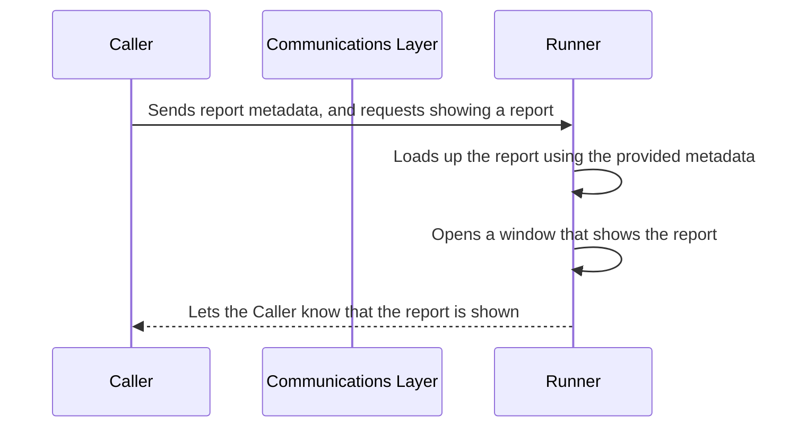

# Crystal Reports Runner

Runner to allow the use of Crystal Reports in .NET Core using external process (in .NET Framework 4.8) and named pipes for communication.

If you are using Crystal Reports in your application you're probably stuck with .NET Framework 4.x. However, all the new features are in the .NET Core framework nowadays and you might want to take advantage of them by upgrading your app to use the latest version of .NET.

Unfortunately, Crystal Reports doesn't support .NET Core so one workaround is to isolate it into its own executable so that your own application doesn't need to have a dependency on Crystal Reports SDK. This library makes it easy to do that by providing:

1. An executable that has a dependency on Crystal Reports (aka the Runner). We support different versions of the Crystal Reports Runtime. You can also create your own runner if you need a runtime version that we don't support currently.
2. A communication layer that allows your app (aka the Caller) to run Crystal Reports via the Runner through Named Pipes.



## Quick Start

1. Create a new Console Application and reference this Nuget packages:

   ```xml
     <ItemGroup>
       <PackageReference Include="LijsDev.CrystalReportsRunner.13.0.20.x64" Version="1.1.0" />
     </ItemGroup>
   ```

   Note: You can choose a version of `LijsDev.CrystalReportsRunner` that supports the Crystal Reports runtime version you need.

2. Create an engine:

   ```csharp
   using LijsDev.CrystalReportsRunner.Core;
   
   using var engine = new CrystalReportsEngine();
   ```

3. Optionally customizing viewer settings:

   ```csharp
   engine.ViewerSettings.AllowedExportFormats =
       ReportViewerExportFormats.PdfFormat |
       ReportViewerExportFormats.ExcelFormat;
   
   engine.ViewerSettings.ShowRefreshButton = false;
   engine.ViewerSettings.ShowCopyButton = false;
   engine.ViewerSettings.ShowGroupTreeButton = false;
   
   engine.ViewerSettings.SetUICulture(Thread.CurrentThread.CurrentUICulture);
   ```

4. Show the report and provide a connection string:

   ```csharp
   var report = new Report("SampleReport.rpt", "Sample Report")
   {
       Connection = CrystalReportsConnectionFactory.CreateSqlConnection(
           ".\\SQLEXPRESS", 
           "CrystalReportsSample")
   };
   
   report.Parameters.Add("ReportFrom", new DateTime(2022, 01, 01));
   report.Parameters.Add("UserName", "Gerardo");
   
   await engine.ShowReportDialog(report);
   ```

For more information please refer to the [samples](./samples) included in the repo.

## Guides

- [Creating a custom Runner](./docs/custom-runner.md)
