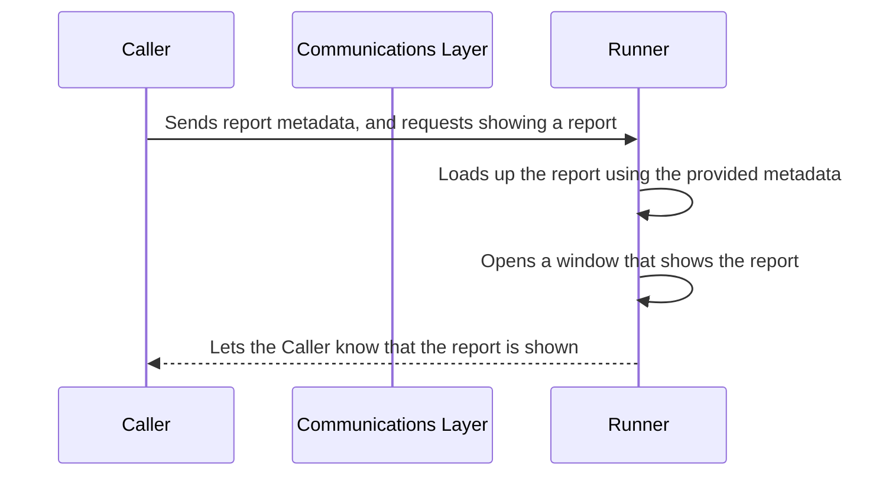

# How this library works

When trying to move away from .NET Framework to .NET (Core), you might find that you have a lot of dependencies that are no longer maintained by their vendors or the vendor is not planning on updating them to support .NET (Core). In the best case scenario you can either remove or replace the dependency but a lot of times that's not possible. Crystal Reports is especially troublesome because companies create hundreds of reports that are difficult to migrate to other reporting technologies or even worse: they allow their customers to create their own custom reports. So replacing Crystal Reports is not just the matter of rewriting some of the code, you also have to migrate all of the reports that depend on it.

One useful pattern in for this case is isolating the dependency into its own executable assembly. In this way, your main application will be free to upgrade to newer versions of .NET and the dependency can still target .NET Framework and work as before.

There are several ways to communicate between processes in Windows:

- Named/Anonymous Pipes
- TCP
- Memory Mapped Files
- Command line arguments + stdin and stdout

We are using a combination of Named Pipes (for sending commands and receiving events), Memory Mapped Files (for transferring heavy payloads), and Command line arguments (for passing in some initial configurations) for this library to be able to offer the most flexibility and performance combination.

This library makes isolating Crystal Reports easy by providing:

1. An executable that has a dependency on Crystal Reports (aka the Runner). We support different versions of the Crystal Reports Runtime. You can also create your own runner if you need a runtime version that we don't support currently. The runner depends on .NET Framework 4.8.x.
2. A communication layer that allows your app (aka the Caller) to run Crystal Reports via the Runner through Named Pipes.

We believe that this pattern can be successfully used in many other scenarios: handling complicating memory leaks, unblocking legacy dependencies, improving performance by parallelizing work.